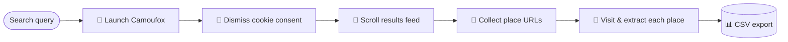

<div align="center">

# 🗺️ Google Maps Extractor

**A resilient, anti-detection web scraper that turns any Google Maps search into a clean CSV of business leads.**

[](https://www.python.org/)
[](https://docs.astral.sh/uv/)
[](https://camoufox.com/)
[](https://playwright.dev/)
[](LICENSE)

</div>

---

## 📋 Table of Contents

- [Overview](#-overview)
- [Features](#-features)
- [Demo](#-demo)
- [How It Works](#-how-it-works)
- [Extracted Data](#-extracted-data)
- [Tech Stack](#-tech-stack)
- [Getting Started](#-getting-started)
- [Usage](#-usage)
- [Output](#-output)
- [Project Structure](#-project-structure)
- [Disclaimer](#-disclaimer)
- [License](#-license)

---

## 🔎 Overview

**Google Maps Extractor** automates the tedious work of collecting business
information from Google Maps. Give it a search query — *"restaurants in New York"*,
*"dentists in Berlin"*, *"cafes in London"* — and it scrolls through the entire
results feed, visits every listing, and exports a structured CSV ready for
analysis, lead generation, or market research.

It runs on top of [**Camoufox**](https://camoufox.com/), a stealth-hardened
Firefox build, so it browses like a real user and sidesteps the bot-detection
that breaks naïve scrapers.

---

## ✨ Features

- 🛡️ **Anti-detection browsing** — powered by Camoufox to evade fingerprinting and bot checks
- 📜 **Automatic infinite scroll** — walks the full results feed until the last listing loads
- 🗃️ **10 structured fields per place** — name, rating, reviews, address, phone, website & more
- ⚙️ **Configurable via CLI *or* `.env`** — sensible defaults, CLI flags override on demand
- 🍪 **Auto-handles cookie consent** — no manual clicking required
- 💾 **Session persistence** — reuses saved browser state to reduce friction
- 🔁 **Crash-resilient scraping** — recovers and continues if a single page fails
- 🪵 **Configurable logging** — `DEBUG` → `ERROR`, so you see exactly what's happening
- 📊 **Clean CSV export** — one tidy file per query, UTF-8 encoded

---

## 🎬 Demo

<div align="center">

<!-- 📌 TIP: record a short GIF of a run and drop it here for maximum impact.
     Save it as docs/demo.gif and uncomment the line below. -->
<!--  -->

> _Add a screenshot or GIF of the scraper running to make this section pop._

</div>

---

## 🧭 How It Works



| # | Stage | What happens |
|---|-------|--------------|
| 1 | **Launch** | Spins up a stealth Camoufox (Firefox) browser and opens the Maps search URL |
| 2 | **Consent** | Detects and accepts Google's cookie-consent form automatically |
| 3 | **Scroll** | Scrolls the results feed in steps until the *end-of-list* marker appears |
| 4 | **Collect** | Harvests every place URL from the loaded feed |
| 5 | **Extract** | Visits each listing and pulls 10 fields via targeted selectors |
| 6 | **Export** | Writes the results to `app/data/<query>.csv` |

---

## 🗃️ Extracted Data

| Field         | Description         |
|---------------|---------------------|
| `name`        | Business name       |
| `rating`      | Star rating         |
| `reviews`     | Number of reviews   |
| `category`    | Business category   |
| `address`     | Street address      |
| `phone`       | Phone number        |
| `website`     | Website URL         |
| `hours`       | Working hours       |
| `price_level` | Price level         |
| `plus_code`   | Google Plus Code    |

---

## 🛠️ Tech Stack

| Tool | Role |
|------|------|
| [**Python 3.14+**](https://www.python.org/) | Core language |
| [**Camoufox**](https://camoufox.com/) | Anti-detection, stealth Firefox browser |
| [**Playwright (sync API)**](https://playwright.dev/) | Browser automation & DOM querying |
| [**uv**](https://docs.astral.sh/uv/) | Fast dependency & project management |
| [**python-dotenv**](https://pypi.org/project/python-dotenv/) | Environment-based configuration |

---

## 🚀 Getting Started

### Requirements

- **Python 3.14+**
- [**uv**](https://docs.astral.sh/uv/) package manager

### Installation

**1. Clone the repository**

```bash
git clone https://github.com/mirai-sh379/Google-Maps-Extractor.git
cd Google-Maps-Extractor
```

**2. Install dependencies**

```bash
uv sync
```

**3. Install the Camoufox browser**

```bash
python -m camoufox fetch
```

**4. Create your `.env` file**

```bash
cp .env.example .env
```

### Configuration

Edit `.env` to set your defaults:

```env
SEARCH_QUERY=restaurants in New York
HEADLESS=true
LOG_LEVEL=DEBUG
```

---

## 💻 Usage

**Run with defaults from `.env`:**

```bash
uv run app/main.py
```

**Override anything via CLI arguments:**

```bash
uv run app/main.py -q "cafes in London" --no-headless --log-level INFO
```

### CLI Arguments

| Argument         | Description                          | Default       |
|------------------|--------------------------------------|---------------|
| `-q, --query`    | Search query                         | from `.env`   |
| `--headless`     | Run browser in headless mode         | `true`        |
| `--no-headless`  | Show the browser window (great for debugging) | —    |
| `--log-level`    | `DEBUG` · `INFO` · `WARNING` · `ERROR` | `DEBUG`     |

---

## 📂 Output

Results are saved to **`app/data/<query>.csv`**, with the query slugified into the filename:

```
app/data/restaurants_in_new_york.csv
app/data/cafes_in_london.csv
```

**Sample output:**

```csv
name,rating,reviews,category,address,phone,website,hours,price_level,plus_code
Joe's Pizza,4.5,"1,234 reviews",Pizza restaurant,"7 Carmine St, New York",+1 212-555-0188,https://joespizzanyc.com,Open ⋅ Closes 4 AM,$$,P27Q+9X New York
```

---

## 🧱 Project Structure

```
Google-Maps-Extractor/
├── app/
│   ├── main.py          # Scraper entry point & full pipeline
│   ├── data/            # CSV output (git-ignored)
│   └── sessions/        # Saved browser session (git-ignored)
├── .env.example         # Configuration template
├── pyproject.toml       # Project metadata & dependencies
├── uv.lock              # Locked dependency versions
└── README.md
```

---

## ⚠️ Disclaimer

This project is intended for **educational and personal use**. Scraping Google
Maps may conflict with [Google's Terms of Service](https://policies.google.com/terms).
You are responsible for how you use this tool — please respect applicable laws,
rate limits, and the privacy of the data you collect.

---

## 📄 License

Released under the **MIT License** — see the [LICENSE](LICENSE) file for details.

Copyright © 2026 **Volodymyr Boiko**

---

<div align="center">

**Built with 🐍 Python & 🦊 Camoufox**

⭐ If you find this project useful, consider giving it a star!

</div>
